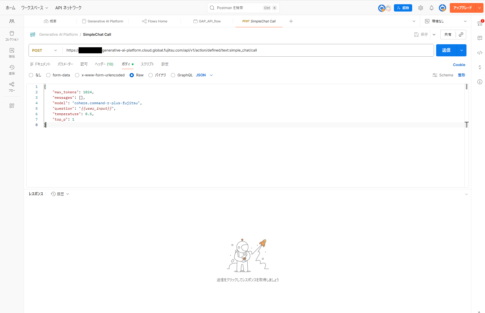
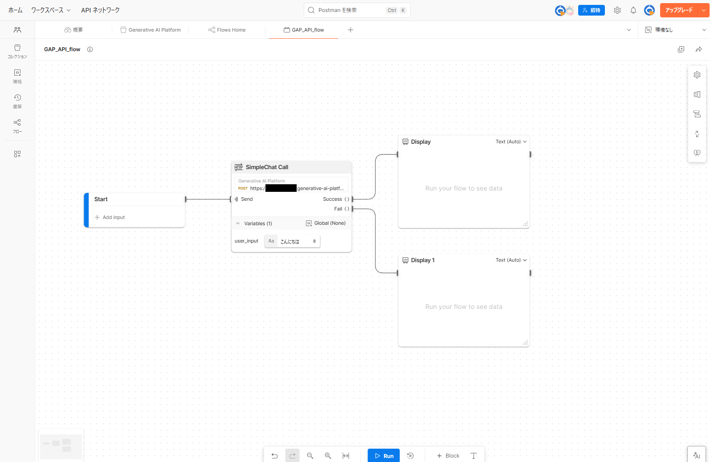
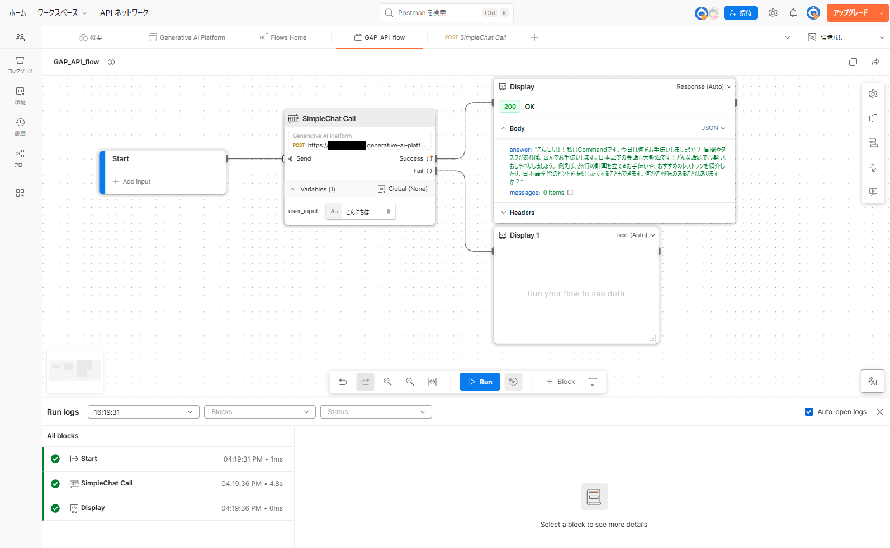

# Postman Flows での GAP API 利用方法

## 概要

このドキュメントは、Postman Flows を使用して GAP (Generative AI Platform) API を利用するための手順を解説します。
Postman Flows を使うことで、API リクエストを視覚的なワークフローとして構築し、実行結果を確認できます。

## 前提条件

- GAP API のコレクションを作成済みであること
- SimpleChat Call API をコレクションに定義していること
- 以下画像のように SimpleChat Call API のリクエストボディは「question」部分だけ変数化し、他設定項目は固定値にしていること

## 1. Flow Module の作成

Flow を管理するための Flow Module を作成します。

1. 左サイドバーから「フロー」を選択します。
2. 「+」ボタンで「Create flow module」を選択します。
3. 作成した Flow module の「...」をクリックして「Rename」で任意の名前に変更します。

## 2. Flow の作成

作成した Flow module をクリックして、Flow の編集画面を開きます。

### 2.1. GAP API ブロックの配置

1. 画面右の編集画面で右クリックして「HTTP Request」ブロックを選択します。
2. 「HTTP Request」ブロックの検索窓で GAP 用に作成したコレクション名を選択します。
3. GAP 用コレクションに定義した API 一覧が表示されます。「SimpleChat Call」API を選択します。  
   （コレクション作成時に SimpleChat Call を登録してある前提）
4. コレクションに登録した API のパラメータが「Variables」に表示されます。
5. 「Variables」右側の「+」ボタンからパラメータを設定します。
   - パラメータの型（String、Bool など）を選択し、入力する値を入力します。
6. 初期状態で配置されている「Start」ブロックの出力から「SimpleChat Call」ブロックの入力につなぎます。

### 2.2. API 実行結果の表示ブロック配置

#### 成功時の結果表示

1. 右クリックして「Display」ブロックを選択します。
2. 任意の位置に「Display」ブロックを配置します。
3. 「HTTP Request」ブロックの「Success ()」から「Display」ブロックの入力につなぎます。  
   API 成功時の結果が表示されます。

#### 失敗時の結果表示

1. 右クリックして新たな「Display」ブロックを選択します。
2. 任意の位置に新しい「Display」ブロックを配置します。
3. 「HTTP Request」ブロックの「Fail ()」から新しい「Display」ブロックの入力につなぎます。  
   API 失敗時の結果が表示されます。

## 3. Flow の実行

1. 編集画面下側の「Run」ボタンをクリックして Flow を実行します。
2. API の実行結果に応じて「Success ()」または「Fail ()」側の「Display」ブロックに結果が表示されます。

## 参考情報

各種ブロックの詳しい説明やより発展的な使い方については、Postman の公式ドキュメントを参照してください。

- [Postman Flows 公式ドキュメント](https://learning.postman.com/docs/postman-flows/overview/)

### 発展的な利用例

Postman Flows では、複数の API を組み合わせた高度なワークフローを構築できます。例えば、GAP API の実行結果を入力として、他社の LLM サービス（OpenAI、Anthropic など）で後処理を行うようなフローも構築可能です。これにより、異なる AI サービスを連携させた柔軟なワークフローを実現できます。
